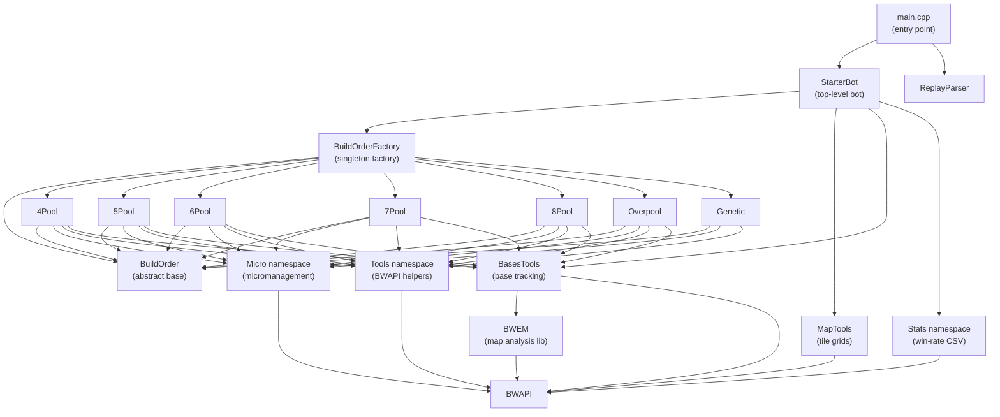

# Architecture

This document describes the high-level structure of IkkriusBot and how its modules interact.

---

## Entry Point

`src/starterbot/main.cpp` connects to BWAPI and runs the game loop. It instantiates either a `StarterBot` (live game) or a `ReplayParser` (replay mode), then dispatches every BWAPI event to the appropriate handler method.

```
main()
 ├── BWAPI::BWAPIClient.connect()  — blocks until StarCraft is running
 └── game loop
      ├── PlayGame()   → StarterBot
      └── ParseReplay() → ReplayParser
```

---

## Module Dependency Diagram



---

## Core Modules

### `StarterBot` — [`src/starterbot/StarterBot.h`](../src/starterbot/StarterBot.h)

The top-level orchestrator. Implements all BWAPI event callbacks (`onStart`, `onFrame`, `onEnd`, `onUnitCreate`, etc.) and delegates to the active `BuildOrder`, `MapTools`, `BasesTools`, `Micro`, and `Stats`.

Key responsibilities:
- **Strategy selection** — On `onStart`, reads historical stats to pick the best build order for the opponent/map, then delegates to `BuildOrderFactory::Create()`
- **Supply management** — `buildAdditionalSupply()` runs every frame to prevent supply blocks
- **Enemy base tracking** — `onUnitShow()` infers enemy base location from visible enemy buildings
- **Debug overlay** — draws unit health bars, bounding boxes, and commands when in debug mode

### `BuildOrder` — [`visualstudio/src/starterbot/BuildOrder.h`](../visualstudio/src/starterbot/BuildOrder.h)

Abstract base class that all strategies inherit. Defines the event contract:

| Method | Trigger |
|--------|---------|
| `onStart()` | Match begins |
| `Execute()` | Called every frame (pure virtual) |
| `onEnd(bool)` | Match ends |
| `OnUnitCreate(unit)` | Unit created (in queue) |
| `onUnitComplete(unit)` | Unit finishes construction |
| `onUnitShow/Hide/Morph/Destroy/Renegade(unit)` | Unit state changes |
| `onSendText(text)` | In-game chat command |
| `GetName()` | Strategy name string (pure virtual) |

All concrete build orders use the **singleton pattern** (`static Instance()` method).

### `BuildOrderFactory` — [`src/starterbot/Factory/BuildOrderFactory.h`](../src/starterbot/Factory/BuildOrderFactory.h)

Simple static factory. Maps `BuildOrderType` enum values to their singleton instances.

Available types: `FourPool`, `FivePool`, `SixPool`, `SevenPool`, `EightPool`, `Genetic`, `Overpool`, `HiveTech`, `MutaHive`, `Adaptive` (default).

`Adaptive` depends on the BWAPI-free `Learning` module ([`src/starterbot/learning/Learning.h`](../src/starterbot/learning/Learning.h)), which holds the composition specs, the timing genome and genetic algorithm, and the composition bandit.

### `Micro` namespace — [`src/starterbot/micro.h`](../src/starterbot/micro.h)

Provides unit-level micromanagement primitives:

| Function | Description |
|----------|-------------|
| `SetMode / GetMode` | Switch between `Aggressive`, `Defensive`, `Neutral` |
| `SmartAttackUnit` | Attack a target with cooldown awareness |
| `SmartKiteTarget` | Ranged unit kiting logic |
| `SmartFleeUntilHealed` | Melee retreat when low HP |
| `SmartScoutMove / ScoutAndWander` | Scout movement patterns |
| `SmartAvoidLethalAndAttackNonLethal` | Group engagement: commit, hit-and-run or withdraw, then focus fire |
| `AssessLocalFight` | Nearby friendly vs. enemy power and ally center (thresholds in `CombatPolicy::AssessEngagement`) |
| `ChooseFocusTarget` | Shared target choice: threats first, then targets allies already hit, weakest, closest |
| `FallBack` | Step away from a threat while drifting toward the group |
| `GatherMinerals / GatherResources` | Worker assignment |
| `unitAttack / attack` | Batch attack commands |
| `BasicAttackAndScoutLoop` | Default frame-by-frame combat loop; leading units wait for the army |
| `HiveTechMicroLoop` | HiveTech/MutaHive army control (Hydra groups, Queens, air units, raid squad) |
| `MutaliskRaidLoop` | Small-flock worker harassment that avoids static anti-air |
| `GuardianAssaultLoop` | Siege from max range; reposition out of anti-air reach during cooldown |
| `Retreat / Flee` | Fallback movement |

### `MapTools` — [`src/starterbot/MapTools.h`](../src/starterbot/MapTools.h)

Builds and maintains grid data about the map:

- `m_walkable` — tile walkability
- `m_buildable` — tile buildability
- `m_depotBuildable` — valid depot placement (respects resource buffers)
- `m_lastSeen` — last frame each tile was visible to us

Provides `isBuildable`, `isWalkable`, `isExplored`, `isVisible` queries and an optional debug map draw toggled by the `m` key command.

### `BasesTools` — [`visualstudio/BasesTools.h`](../visualstudio/BasesTools.h)

Tracks base positions using **BWEM** analysis:

- Caches all BWEM base positions at game start (`CacheBWEMBases`)
- Identifies our main, natural, 3rd, 4th, and 5th bases
- Tracks known enemy base positions and verifies them each frame
- Finds the next optimal expansion position (`GetNextExpansionPosition`)
- Provides draw helpers for debug overlay

### `Stats` namespace — [`src/starterbot/stats/stats.h`](../src/starterbot/stats/stats.h)

Persists match results to `src/starterbot/stats/data/strats-v1.csv`. Format:

```
opponent,opponentRace,mapHash,strategy,games,wins
```

- `readStrategy()` — reads the CSV on game start and returns the strategy with the highest win rate for the current opponent+map combination, falling back to best win rate against the opponent's race.
- `updateWinRateFile()` — appends or updates the relevant row after every game.

### `Tools` namespace — [`src/starterbot/Tools.h`](../src/starterbot/Tools.h)

General-purpose BWAPI helpers used by build orders and micro:

- Unit counting and querying (`CountUnitOfType`, `GetUnitOfType`)
- Building placement (`TryBuildBuilding`, `BuildBuildingOptimal`)
- Unit training and morphing (`TrainUnit`, `MorphLarva`)
- Research (`ResearchUpgrade`, `ResearchTech`)
- Supply calculation (`GetTotalSupply`)
- Debug drawing (`DrawUnitHealthBars`, `DrawUnitCommands`, `DrawUnitBoundingBoxes`)

### `BWEM` — [`BWEM/`](../BWEM/)

Third-party Brood War Easy Map library. Provides terrain analysis, chokepoint detection, base location discovery, and area connectivity. Used exclusively through `BasesTools`.

---

## Data Flow — Game Start

```
onStart()
  └── Stats::readStrategy(opponent, race, mapHash)
        └── reads strats-v1.csv → returns best strategy name
  └── BuildOrderFactory::Create(BuildOrderType::Overpool)   ← currently hardcoded
  └── BasesTools::Initialize() + FindExpansions()
  └── MapTools::onStart()
  └── currentBuildOrder->onStart()
```

> [!NOTE]
> Strategy selection from stats is read but the selected build order is currently hardcoded to `Overpool`. See [`docs/CONTRIBUTING.md`](CONTRIBUTING.md) for how to wire stats selection into the factory call.

---

## Data Flow — Each Frame

```
onFrame()
  └── BasesTools::VerifyEnemyBases()
  └── MapTools::onFrame()
  └── StarterBot::buildAdditionalSupply()
  └── currentBuildOrder->Execute()
        └── Tools::* (build, morph, train)
        └── Micro::BasicAttackAndScoutLoop() or custom micro
```
